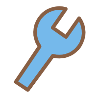
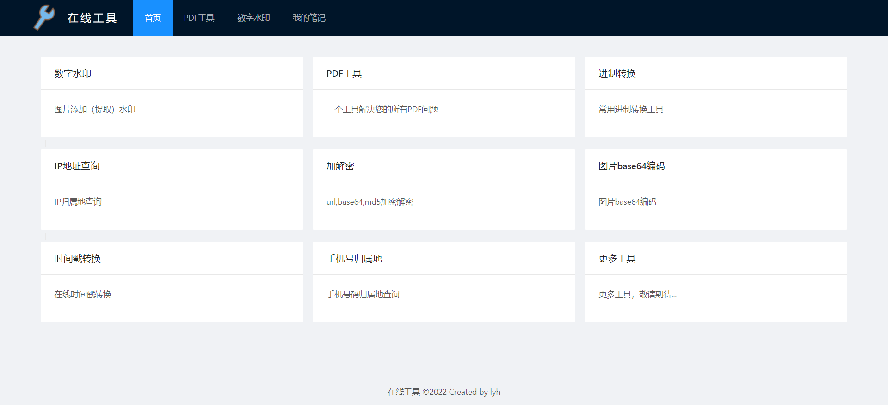
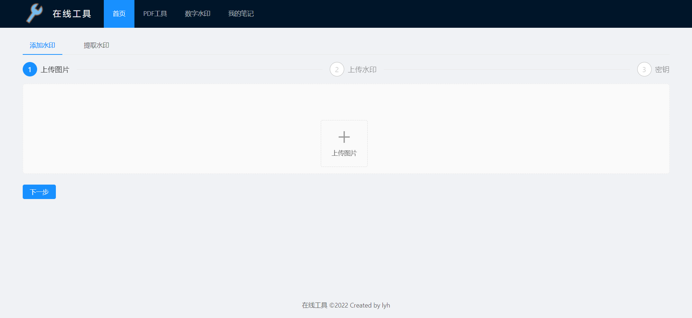
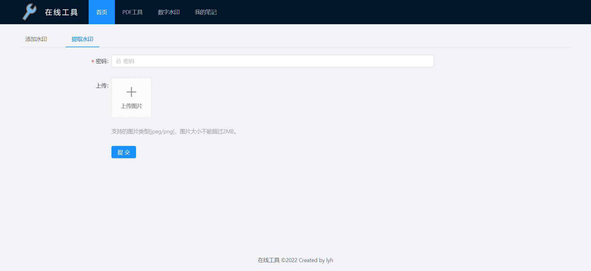

# 在线工具


<div align="center"></div>

ʕ•̫͡•ʔ-̫͡-ʕ•͓͡•ʕ•̫͡•ʔ-̫͡-ʕ•͓͡•ʔ-̫͡-ʔ

> 在线工具 - 你的工具箱

## ✨项目介绍

一个帮助大家提高工作效率的在线工具网站

项目的技术栈包括vue、ant-design-vue、axios、vuex、vue-router等，目前实现的功能如下：

- [x] 数字水印
- [ ] PDF工具
- [ ] 进制转换
- [ ] IP地址查询
- [ ] 加解密
- [ ] 图片base64编码
- [ ] 时间戳转换
- [ ] 手机号归属地
- [ ] ……

## 🐳项目展示







更多实用工具，敬请期待……

## 🔧项目启动

```
npm install
```

### Compiles and hot-reloads for development

```
npm run serve
```

### Compiles and minifies for production

```
npm run build
```

### Customize configuration

See [Configuration Reference](https://cli.vuejs.org/config/).

## 🤝 欢迎贡献

对于一些 Bug 修复和细节优化，欢迎直接提交 PR 🌹

## 🔗参考资料

[https://cn.vuejs.org/](https://cn.vuejs.org/)

[https://1x.antdv.com/docs/vue/introduce-cn/](https://1x.antdv.com/docs/vue/introduce-cn/)

